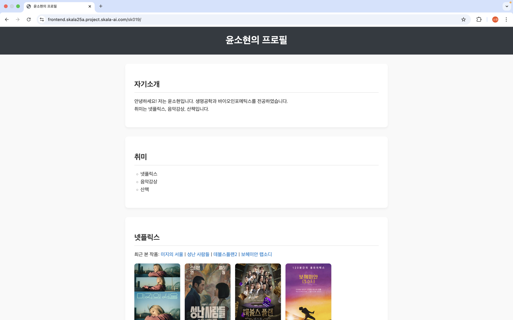

# Docker #5 3일차 실습: kubernetes 환경에 나의 앱을 배포해보자

#2025-08-04

---

### 0. 작업 정보

#1 작업 위치

```shell
$ pwd
/Users/yshmbid/rde/config/workspace/exec-template
```

#2 파일 구조

```plain text
/workspace
└── exec-template
     ├── Dockerfile
     ├── default.conf
     ├── docker-build.sh
     ├── docker-push.sh
     ├── cicd.sh 
     ├── deploy/
     │   ├── deploy.t   
     │   ├── deploy.sh     
     │   ├── service.t
     │   ├── service.sh 
     │   └── env.properties
     └── src/
         ├── index.html      
         └── media/ 
```

#3 이전 실습과의 차이 

1. cicd.sh를 쓴다.
2. deploy 디렉토리를 쓴다. 
3. docker-build.sh와 docker-push.sh에서 amd였던걸 arm으로 바꿔줬는데 이걸다시 amd로 바꿔준다.

### 1. cicd.sh 작성

```shell
#!/bin/bash

# 기본값 설정
ENV_FILE="env.properties"

# usage 출력 함수
usage() {
  echo "Usage: $0 [-b|--build] [-p|--push] [-y|--yaml] [-d|--deploy] [-r|--remove] [-a|--all] [-f|--file <env file>]"
  exit 1
}

# env.properties 로드 함수
load_env() {
  if [ -f "$ENV_FILE" ]; then
    source "$ENV_FILE"
  else
    echo "환경 파일 '$ENV_FILE'을 찾을 수 없습니다."
    exit 1
  fi
}

# Maven Build
build() {
  echo "🔨 Maven 빌드 시작..."
  mvn clean package
}

# Docker 이미지 build & push
push_image() {
  echo "🐳 Docker 이미지 생성 및 push 시작..."
  docker build -t $DOCKER_IMAGE_NAME .
  docker push $DOCKER_IMAGE_NAME
}

# YAML 생성
generate_yaml() {
  echo "📄 YAML 파일 생성 중..."
  for file in *.t; do
    [ -e "$file" ] || continue
    cp "$file" "${file%.t}.yaml"
  done
}

# K8s에 배포
deploy_k8s() {
  echo "🚀 Kubernetes에 배포 시작..."
  kubectl apply -f ./*.yaml
}

# K8s 리소스 삭제
remove_k8s() {
  echo "🗑️ Kubernetes 리소스 제거..."
  kubectl delete -f ./*.yaml
}

# 전체 실행
run_all() {
  load_env
  build
  push_image
  generate_yaml
  deploy_k8s
}

# 인자 파싱
while [[ "$#" -gt 0 ]]; do
  case "$1" in
    -b|--build) ACTION_BUILD=1 ;;
    -p|--push) ACTION_PUSH=1 ;;
    -y|--yaml) ACTION_YAML=1 ;;
    -d|--deploy) ACTION_DEPLOY=1 ;;
    -r|--remove) ACTION_REMOVE=1 ;;
    -a|--all) ACTION_ALL=1 ;;
    -f|--file)
      shift
      ENV_FILE="$1"
      ;;
    -h|--help)
      usage
      ;;
    *)
      echo "❌ 알 수 없는 옵션: $1"
      usage
      ;;
  esac
  shift
done

# 실행 조건
if [[ $ACTION_ALL ]]; then
  run_all
else
  load_env
  [[ $ACTION_BUILD ]] && build
  [[ $ACTION_PUSH ]] && push_image
  [[ $ACTION_YAML ]] && generate_yaml
  [[ $ACTION_DEPLOY ]] && deploy_k8s
  [[ $ACTION_REMOVE ]] && remove_k8s
fi
```

cicd.sh 사용하는 부분이 나오는데 ppt랑 workspace 디렉토리 안에 아무리찾아봐도 없어서... 일단 챗지피티에넣고 만들었는데

막상 뒤에서는 cicd.sh 쓰는대신 그자리에 `kubectl apply -f deploy.yaml`
`kubectl apply -f service.yaml` 을 해줬다.

### 2. deploy 디렉토리

deploy 디렉토리의 deploy.t와 service.t는 각각 .sh로 바꿔준다.

```shell
# deploy.sh

apiVersion: apps/v1
kind: Deployment
metadata:
  name: sk019-posts-get
  namespace: skala-practice
spec:
  replicas: 1
  selector:
    matchLabels:
      app: sk019-posts-get
  template:
    metadata:
      labels:
        app: sk019-posts-get
    spec:
      containers:
        - name: posts-get amdp-registry.skala-ai.com/skala25a/sk019-posts-get.amd64:1.0
          ports:
            - containerPort: 80
```
```shell
# service.sh

apiVersion: v1
kind: Service
metadata:
  name: ${USER_NAME}-${SERVICE_NAME}
  namespace: ${NAMESPACE}
spec:
  selector:
    app: ${USER_NAME}-${SERVICE_NAME}
  ports:
    - name: http
      protocol: TCP
      port: 8888 #8080
      targetPort: 80
  type: ClusterIP
```

- deploy.sh에서 amd를 유지해주고
- service.sh는 원래 8080 돼있었는데 8888 같아서 바꿔줌.

```shell
#env.properties

SERVICE_NAME="posts-get"

#***** NEVER Rewrite ****************************************
DOCKER_REGISTRY="amdp-registry.skala-ai.com/skala25a"
DOCKER_REGISTRY_USER="robot\$skala25a"
DOCKER_REGISTRY_PASSWORD="1qB9cyusbNComZPHAdjNIFWinf52xaBJ"
DOCKER_CACHE="--no-cache"

DEPLOY_PATH="."
DEPLOY_FILE_NAME=deploy.yaml
DEPLOY_FILE_LIST="deploy.yaml service.yaml"
# amd64 | arm64
CPU_PLATFORM=amd64
#CPU_PLATFORM=arm64
#***** NEVER REWRITE ****************************************


#------ USER Customization area --------------------------
USER_NAME=sk019
NAMESPACE=skala-practice
VERSION="1.0"
#------ USER Customization area --------------------------
```

env.properties의 CPU_PLATFORM=amd64으로 설정하기.

```shell
# deploy.sh

export USER_NAME=sk019
export SERVICE_NAME=posts-get
export NAMESPACE=skala-practice

apiVersion: apps/v1
kind: Deployment
metadata:
  name: ${USER_NAME}-${SERVICE_NAME}
  namespace: ${NAMESPACE}
spec:
  replicas: 1
  selector:
    matchLabels:
      app: ${USER_NAME}-${SERVICE_NAME}
  template:
    metadata:
      annotations:
        prometheus.io/scrape: 'true'
        prometheus.io/port: '8888' #'8080'
        prometheus.io/path: '/prometheus'
        update: e8c24298b888a2dc0795de1564bca2da12
      labels:
        app: ${USER_NAME}-${SERVICE_NAME}
    spec:
      containers:
      - name: ${USER_NAME}-${SERVICE_NAME}
        image: amdp-registry.skala-ai.com/skala25a/${USER_NAME}-posts-get.amd64:1.0
        #image: amdp-registry.skala-ai.com/skala25a/${USER_NAME}-posts-get.arm64:1.0
        #image: amdp-registry.skala-ai.com/skala25a/${USER_NAME}-posts-get:1.0

        imagePullPolicy: Always
```

```shell
# service.sh

apiVersion: v1
kind: Service
metadata:
  name: ${USER_NAME}-${SERVICE_NAME}
  namespace: ${NAMESPACE}
spec:
  selector:
    app: ${USER_NAME}-${SERVICE_NAME}
  ports:
    - name: http
      protocol: TCP
      port: 8888 #8080
      targetPort: 80
  type: ClusterIP
```
deploy.sh에서 amd64로 해주고 service.sh에서 port: 8888로 변경해줌.

### 3. docker-build.sh와 docker-push.sh 재수정

```shell
# docker-build.sh

#!/bin/bash
NAME=sk019
IMAGE_NAME="healthcheck-server" #IMAGE_NAME="webserver"

VERSION="1.0.0"
CPU_PLATFORM=amd64 #arm64 #amd64

# Docker 이미지 빌드
docker build \
  --tag ${NAME}-${IMAGE_NAME}:${VERSION} \
  --file Dockerfile \
  --platform linux/${CPU_PLATFORM} \
  ${IS_CACHE} .
```

arm을 amd로 다시바꿔줫다.

```shell
# docker-push.sh

#!/bin/bash
NAME=sk019
IMAGE_NAME="healthcheck-server" #IMAGE_NAME="webserver"

VERSION="1.0.0"

DOCKER_REGISTRY="amdp-registry.skala-ai.com/skala25a"
DOCKER_REGISTRY_USER="robot\$skala25a"
DOCKER_REGISTRY_PASSWORD="1qB9cyusbNComZPHAdjNIFWinf52xaBJ"
DOCKER_CACHE="--no-cache"

# 1. Docker 레지스트리에 로그인 (옵션: 이 스크립트를 실행하기 전에 미리 로그인해두어도 됩니다)
echo ${DOCKER_REGISTRY_PASSWORD} | docker login ${DOCKER_REGISTRY} \
	-u ${DOCKER_REGISTRY_USER}  --password-stdin \
   	|| { echo "Docker 로그인 실패"; exit 1; }

# 2. harbor 로 push 하기 위해 tag 추가
docker tag  ${NAME}-${IMAGE_NAME}.amd64:${VERSION} ${DOCKER_REGISTRY}/${NAME}-${IMAGE_NAME}.amd64:${VERSION}
$docker tag  ${NAME}-${IMAGE_NAME}.arm64:${VERSION} ${DOCKER_REGISTRY}/${NAME}-${IMAGE_NAME}.arm64:${VERSION}


# Docker 이미지 푸시
docker push ${DOCKER_REGISTRY}/${NAME}-${IMAGE_NAME}.amd64:${VERSION}
#docker push ${DOCKER_REGISTRY}/${NAME}-${IMAGE_NAME}.arm64:${VERSION}
```

마찬가지 arm을 amd로 바꿔줌.

### 4. Docker 이미지 빌드, 푸시, kubernetes 환경에 배포

```shell
# 1. 빌드
$ sudo docker build --platform=linux/amd64 -t amdp-registry.skala-ai.com/skala25a/sk019-posts-get:1.0 .

# 2. 푸시
$ sudo docker push amdp-registry.skala-ai.com/skala25a/sk019-posts-get:1.0

# 3. kubernetes 환경에 배포
$ cicd.sh –y
$ kubectl apply -f deploy.yaml
$ kubectl apply -f service.yaml


# 재시작
# $ kubectl rollout restart deployment sk019-posts-get -n skala-practice

# 4. pod 확인 및 포트 포워딩
$ kubectl get pod -n skala-practice | grep sk019
$ kubectl port-forward pod/<pod_이름> 9999:80 -n skala-practice

# 예시 출력
# $ kubectl get pod -n skala-practice | grep sk019 의 결과
# sk019-posts-get-7fd8d8bc6b-k7hsz   1/1     Running   0          10s 인 경우 
# kubectl port-forward pod/sk019-posts-get-7fd8d8bc6b-k7hsz 9999:80


# 접속링크: http://localhost:9999/sk019
# browser 접속링크: https://frontend.skala25a.project/skala􏰂ai.com/sk000
```


이렇게 하면 나와야되는데 계속 404 에러가 났다.

#

### 5. 비고

1. deploy.sh: 챗지피티에서 amd64 떼라고해서 마지막엔 `image: amdp-registry.skala-ai.com/skala25a/${USER_NAME}-posts-get:1.0`도 썼다 

2. deploy.yaml: 마찬가지로 amd64 떼라고해서 `amdp-registry.skala-ai.com/skala25a/sk019-posts-get:1.0`도 썼다.

3. defalut.conf는 다음 버전을 써봤다.

```shell
# default.conf 원래 버전
server {
    listen 80;
    
    location /sk019 {
        alias /usr/share/nginx/html/;
        try_files $uri $uri/ /index.html;
        
    }
}

# ver1
server {
    listen 80;

    location /sk019 {
        root /usr/share/nginx/html;
        index index.html;
        try_files $uri $uri/ /index.html;
    }
}

# ver2
server {
    listen 80;

    location /sk019/ {
        alias /usr/share/nginx/html/;
        index index.html;
        try_files $uri $uri/ /index.html;
    }
}
```

4. cicd.sh -y 스크립트가 존재하지 않는 경우에 `kubectl apply -f deploy.yaml`와 `kubectl apply -f service.yaml`로 대체 가능하대서 그냥 패스했는데 그래도 되는게 맞는지 모르겟음

#

#8.8추가

교수님께 질문사항 디엠 보냈는데 

> 우선 deploy를 통해 자신이 만들어놓은 컨테이너 이미지를 클라우드 환경으로 잘 배포했습니다.
> 
> 그리고 service를 통해 나의 컨테이너 내 80포트를 노출하고 있는 nginx를 외부에서 접속 가능하도록 잘 연결했습니다. 이것은 어디서든 접속가능하게 하기 위한 ingress 설정이 있는데 이것은 제가 미리 만들어놓아서 위의 URL로 접속됩니다.
> 
> 단지 내가 외부 접속을 위한 ingress 설정에 등록했던 service 이름인 sk019-posts-get이였는데 sk019-posts-get-svc로 만들어 놓아서
이름만 변경해놓았습니다.

라고 오셔서 확인해보니까 말도안되게 service.yaml이 다음과같이 작성돼있었다

```shell
apiVersion: v1
kind: Service
metadata:
  name: sk019-posts-get-svc
  namespace: skala-practice
spec:
  selector:
    app: sk019-posts-get
  ports:
    - protocol: TCP
      port: 80
      targetPort: 80
  type: ClusterIP
  ```

  아니근데 위 작업 하면서 쓴 챗지피티 대화창에 'sk019-posts-get' 치면 어디서도 'sk019-posts-get-svc'라는 단어가 없는데....... 어디서 나온건지 모르겟다

 

  아무튼 링크를 확인해보니까 잘들어가있다 ㅎㅎ

#
